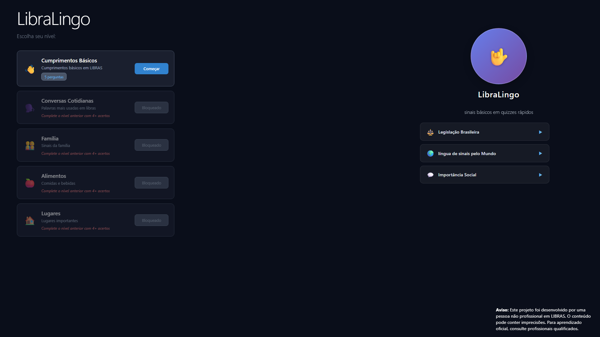
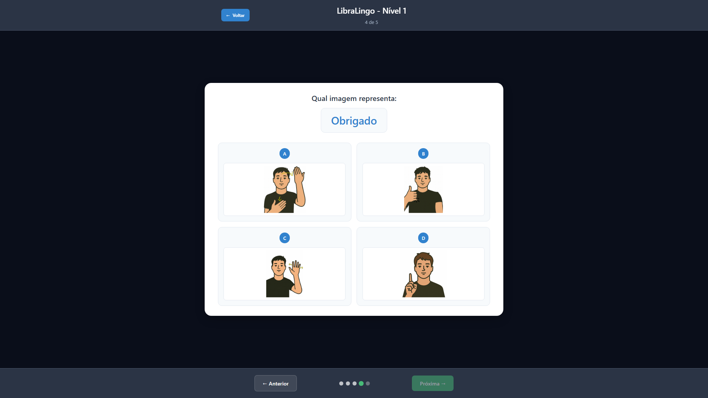
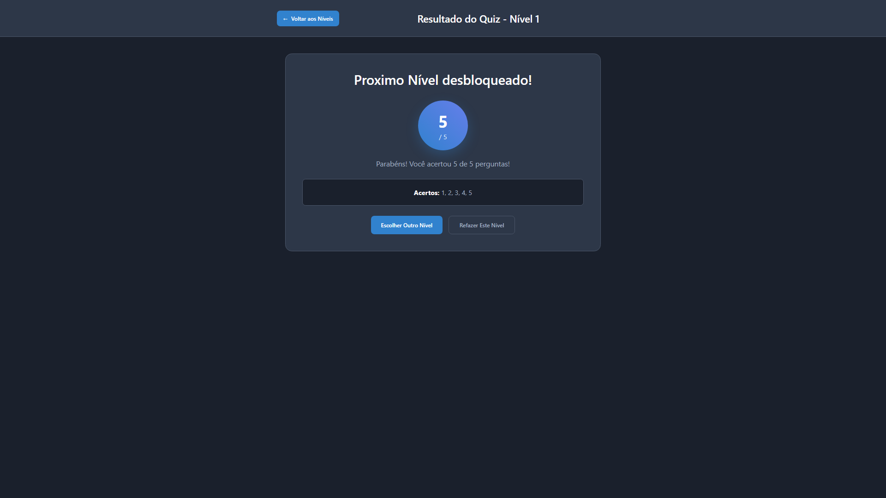

# LibraLingo


### Acesse a aplicação: [https://libralingo.up.railway.app](https://libralingo.up.railway.app)


## Sobre o Projeto

LibraLingo é uma aplicação web com quizzes de  **Língua Brasileira de Sinais (LIBRAS)**. Com 5 niveis e 5 perguntas em cada nivel


**Um projeto composto por:**
- **Backend REST API** desenvolvido com Java e Spring Boot
- **Frontend** desenvolvido com Angular e TypeScript

### Ferramentas Utilizadas
**Backend:**
- Java 21
- Spring Boot
- Maven
- Jackson JSON

**Frontend:**
- Angular
- TypeScript


**Deploy:**
- Docker
- Railway (plataforma de hospedagem)

### Contexto e Motivação

Este projeto foi criado para consolidar meus conhecimentos em desenvolvimento full-stack,
integrando um backend em Spring Boot com um frontend em Angular. O objetivo foi construir uma 
aplicação completa, com arquitetura limpa, API organizada e deploy funcional, simulando uma aplicação
real em produção.

### Tela Inicial - Seleção de Níveis


### Tela de Quiz


### Tela de Resultado


## Executar localmente

### Pré-requisitos

- **Java 21**
- **Node.js 20**
- **Maven 3.9+**
- **Angular CLI**
- **Git**

**Clone o repositório:**

```bash
git clone https://github.com/mmmichael-carvalho/LibraLingo.git
cd LibraLingo
```


**Instalar dependências**  
*Back-end:*

```bash
cd backend
mvn clean install
```

*Front-end:*
```bash
cd ../frontend
npm install
```

Para executar a aplicação localmente, você precisa iniciar o backend e o frontend em terminais separados  
*Terminal 1 - Backend*
```bash
cd backend
mvn spring-boot:run
```

Backend rodando em: `http://localhost:8080`

*Terminal 2 - Frontend*
```bash
cd frontend
ng serve
```
Frontend rodando em: `http://localhost:4200`  
<br>Acesse a aplicação por **`http://localhost:4200`**


## API Endpoints

### GET `/api/quiz/levels/{level}/questions`

Retorna todas as perguntas de um nível específico.

**Parâmetros:**
- `level` (path parameter) - Número do nível (1-5)

**Exemplo de Request:**
```http
GET /api/quiz/levels/1/questions
```

**Exemplo de Response:**
```json
[
  {
    "id": 1,
    "level": 1,
    "tipo": "IMAGEM_PARA_TEXTO",
    "prompt": "/images/nivel1/oi1.png,/images/nivel1/oi12.png",
    "opcoes": [
      {
        "texto": "Bom dia",
        "imagemUrl": null
      },
      {
        "texto": "Boa tarde",
        "imagemUrl": null
      },
      {
        "texto": "Oi",
        "imagemUrl": null
      },
      {
        "texto": "Tudo bem?",
        "imagemUrl": null
      }
    ],
    "indiceCorreto": 2
  }
]
```

---

### POST `/api/quiz/respostas`

Calcula o resultado do quiz com base nas respostas fornecidas.

**Request Body:**
```json
[
  {
    "perguntaId": 1,
    "opcaoEscolhida": 2
  },
  {
    "perguntaId": 2,
    "opcaoEscolhida": 3
  }
]
```

**Response:**
```json
{
  "pontuacao": 4,
  "totalPerguntas": 5,
  "acertos": [1, 2, 3, 4],
  "erros": [5],
  "mensagem": "Voce acertou 4 de 5 perguntas"
}
```

### Disclaimer
Este projeto foi desenvolvido com fins educacionais e de aprendizado. O conteúdo pode conter imprecisões. Para aprendizado oficial de LIBRAS, consulte profissionais qualificados e instituições especializadas.